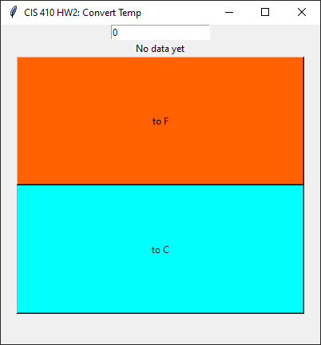
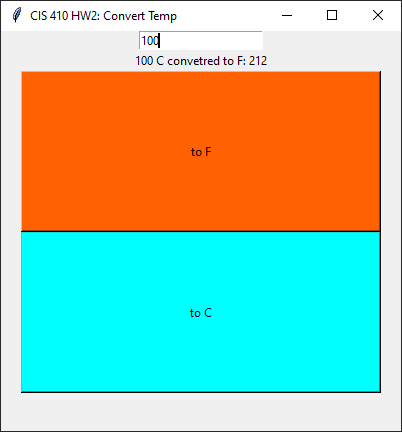

A Gui menu to convert temps.

# How to use

Once the poetry env is setup (see below)

run:
```poetry run python .\hw2\main.py```

A window will open showing the interface:



Enter a number (int) and click on your prefered temp.




- to F assumes the entered number is in C
- to C assumed the entered number is in F

# Enviroment Setup

This project uses poetry to ensure consitent builds.

All commands are ran from the root of the project.

to install poetry (if not already installed): 

```pip install poetry```

to install project:

```poetry install```

to run type testing:

```poetry run mypy .\hw2\```

to run the code formater:

``` poetry run black -l 120 hw2```